## electronic music 1996 - 2001

The official release of my [Scream Tracker](https://en.wikipedia.org/wiki/Scream_Tracker) songs.

**[Listen Online](https://defgsus.github.io/defgsus-music/)** or **[Download zip](https://github.com/defgsus/defgsus-music/archive/refs/heads/master.zip)**.

I did all of them on a 386 SX with 4mb of memory, although the ScreamTracker did only use the
base memory window, so you could use about 450kb. This is not so bad since an instrument
could only be 64k samples long. That again is the entire memory available to the Commodore 64,
so actually, i had quite a nice setup.

To *release an album*, the songs were played in the
[Inertia Player](https://www.pouet.net/prod.php?which=29208) and recorded to 90 minutes cassette tapes,
relentlessly twisting the volume knob just slightly to simulate a kind of mastering. All of these tapes
have gone to friends and today i can only enjoy my memories and this actual stack of S3M files that were
still on some old harddrive.

For some records i could reconstruct the intended order of songs from the booklet or a
still existing listing file. There was much more visual artwork but that seems to be lost.

I hereby release all of it under the *Creative Commons Attribution-NonCommercial-ShareAlike 4.0* license.
The non-commercial part comes from the fact that i never earned money with it (although i tried)
so why should you? But, don't hesitate to play it in a club and earn a fee, i'm not a nazi.

---------

## [DAS S](./MODULE/DAS_S)

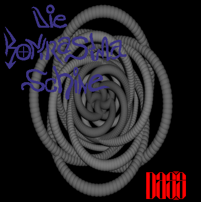
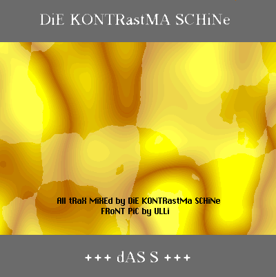

Still in school, heavily in love, lost the girl, went back home and made this album.

- [ein vorspiel](https://raw.githubusercontent.com/defgsus/defgsus-music/master/MODULE/DAS_S/INTRO.S3M)
- [loved: d.d.e.g.s.](https://raw.githubusercontent.com/defgsus/defgsus-music/master/MODULE/DAS_S/DDEGS.S3M)
- [i.h.d.g.s](https://raw.githubusercontent.com/defgsus/defgsus-music/master/MODULE/DAS_S/IHDGS.S3M)
- [brok'n](https://raw.githubusercontent.com/defgsus/defgsus-music/master/MODULE/DAS_S/UNBEAT.S3M)
- [saltflaxs](https://raw.githubusercontent.com/defgsus/defgsus-music/master/MODULE/DAS_S/SALT.S3M)
- [lecka musik](https://raw.githubusercontent.com/defgsus/defgsus-music/master/MODULE/DAS_S/LECKA.S3M)
- [das konzipierte chaos](https://raw.githubusercontent.com/defgsus/defgsus-music/master/MODULE/DAS_S/DAKOS.S3M)
- [VEB schraube](https://raw.githubusercontent.com/defgsus/defgsus-music/master/MODULE/DAS_S/BEAT.S3M)
- [akm< dulap0l &duljia @](https://raw.githubusercontent.com/defgsus/defgsus-music/master/MODULE/DAS_S/BLA.S3M)
- [choosen & grabed](https://raw.githubusercontent.com/defgsus/defgsus-music/master/MODULE/DAS_S/GRABED.S3M)
- [travelence](https://raw.githubusercontent.com/defgsus/defgsus-music/master/MODULE/DAS_S/GROOVE.S3M)
- [die kontrastma schine](https://raw.githubusercontent.com/defgsus/defgsus-music/master/MODULE/DAS_S/MASHINE.S3M)
- [lezztendlich](https://raw.githubusercontent.com/defgsus/defgsus-music/master/MODULE/DAS_S/OUTRO.S3M)

## [GÄA](./MODULE/GAEA)

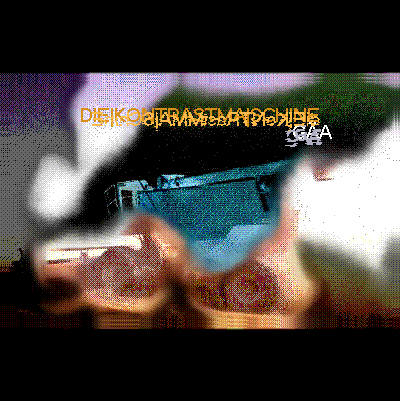

Based on the novels by Wolfgang Hohlbein *Die Töchter des Drachen* and *Der Thron der Libelle*.
Hohlbein is not a particular *good* writer but his stories can be overwhelming and the writing
style is not important for a 15 years old.

- [intro](https://raw.githubusercontent.com/defgsus/defgsus-music/master/MODULE/GAEA/INTRO.S3M)
- [atom](https://raw.githubusercontent.com/defgsus/defgsus-music/master/MODULE/GAEA/ATOM.S3M)
- [goldrausch](https://raw.githubusercontent.com/defgsus/defgsus-music/master/MODULE/GAEA/GOLD.S3M)
- [hraban](https://raw.githubusercontent.com/defgsus/defgsus-music/master/MODULE/GAEA/HRABAN.S3M)
- [kara](https://raw.githubusercontent.com/defgsus/defgsus-music/master/MODULE/GAEA/KARA.S3M)
- [kara \(RMX\)](https://raw.githubusercontent.com/defgsus/defgsus-music/master/MODULE/GAEA/KARA_RMX.S3M)
- [rot](https://raw.githubusercontent.com/defgsus/defgsus-music/master/MODULE/GAEA/ROT.S3M)
- [schelfheim](https://raw.githubusercontent.com/defgsus/defgsus-music/master/MODULE/GAEA/SCHELFH.S3M)
- [stahldorf](https://raw.githubusercontent.com/defgsus/defgsus-music/master/MODULE/GAEA/STAHL.S3M)
- [stahldorf \(RMX\)](https://raw.githubusercontent.com/defgsus/defgsus-music/master/MODULE/GAEA/STAHL\(R\).S3M)
- [sweet simplicity](https://raw.githubusercontent.com/defgsus/defgsus-music/master/MODULE/GAEA/SWEET.S3M)

## [culmination](./MODULE/CULMINAT)

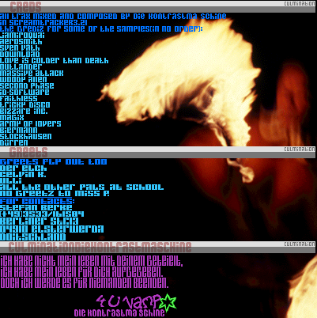
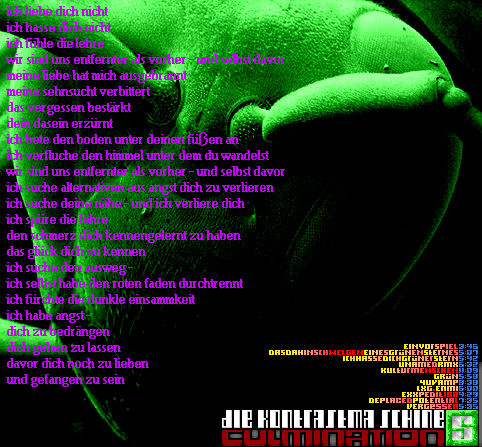

Still in school, still sad about the girl(s). **Mate Galic** was promoting experimental music
on german TV music station *VIVA II* and i was increasingly *sucked in*.

- [ein vorspiel](https://raw.githubusercontent.com/defgsus/defgsus-music/master/MODULE/CULMINAT/INTRO.S3M)
- [d.d.e.g.s.](https://raw.githubusercontent.com/defgsus/defgsus-music/master/MODULE/CULMINAT/DDEGS.S3M)
- [i.h.d.g.s](https://raw.githubusercontent.com/defgsus/defgsus-music/master/MODULE/CULMINAT/IHDGS.S3M)
- [unnamed RMX](https://raw.githubusercontent.com/defgsus/defgsus-music/master/MODULE/CULMINAT/DDEGS_X1.S3M)
- [kulturmenschen](https://raw.githubusercontent.com/defgsus/defgsus-music/master/MODULE/CULMINAT/HARMONIE.S3M)
- [grün](https://raw.githubusercontent.com/defgsus/defgsus-music/master/MODULE/CULMINAT/LAST.S3M)
- [4U VAMP](https://raw.githubusercontent.com/defgsus/defgsus-music/master/MODULE/CULMINAT/4UVAMP.S3M)
- [LXG. ENMI](https://raw.githubusercontent.com/defgsus/defgsus-music/master/MODULE/CULMINAT/LXGENMI.S3M)
- [exxpedition](https://raw.githubusercontent.com/defgsus/defgsus-music/master/MODULE/CULMINAT/LXGENMIR.S3M)
- [deplaced potential](https://raw.githubusercontent.com/defgsus/defgsus-music/master/MODULE/CULMINAT/POTENT.S3M)
- [vergessen](https://raw.githubusercontent.com/defgsus/defgsus-music/master/MODULE/CULMINAT/FORGOT.S3M)

## [das leben vor dem tod](./MODULE/LEBEN)

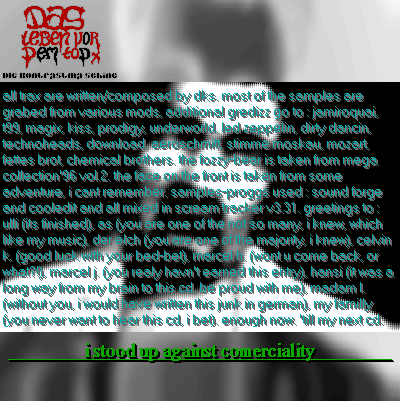

I can't really tell the order of all the albums any more and i long since lost the file's 
modification timestamps. It's possible though, that this album was the beginning of my
new life after all that broken heart shit.

- [ein vorspiel](https://raw.githubusercontent.com/defgsus/defgsus-music/master/MODULE/LEBEN/INTRO.S3M)
- [versuchsobjekt des lebens](https://raw.githubusercontent.com/defgsus/defgsus-music/master/MODULE/LEBEN/VERSUCH.S3M)
- [ÜBerfahrung......](https://raw.githubusercontent.com/defgsus/defgsus-music/master/MODULE/LEBEN/UEBER.S3M)
- [hierarchie des begreifens](https://raw.githubusercontent.com/defgsus/defgsus-music/master/MODULE/LEBEN/HIERARCH.S3M)
- [the haze](https://raw.githubusercontent.com/defgsus/defgsus-music/master/MODULE/LEBEN/HAZE.S3M)
- [boris b sein marktplazz](https://raw.githubusercontent.com/defgsus/defgsus-music/master/MODULE/LEBEN/MARKTPLA.S3M)
- [meine ewige liebe hat sich weiterentwickelt zu tiefem hass](https://raw.githubusercontent.com/defgsus/defgsus-music/master/MODULE/LEBEN/MEINE_LI.S3M)
- [vergessen \(rmx\)](https://raw.githubusercontent.com/defgsus/defgsus-music/master/MODULE/LEBEN/VERG_RMX.S3M)
- [\(c\)law](https://raw.githubusercontent.com/defgsus/defgsus-music/master/MODULE/LEBEN/\(C\)LAW.S3M)
- [o-saft-molli](https://raw.githubusercontent.com/defgsus/defgsus-music/master/MODULE/LEBEN/MOLLI.S3M)
- [---](https://raw.githubusercontent.com/defgsus/defgsus-music/master/MODULE/LEBEN/D&B.S3M)
- [oberflächliche liebe](https://raw.githubusercontent.com/defgsus/defgsus-music/master/MODULE/LEBEN/OBERFL.S3M)
- [OUTRO I](https://raw.githubusercontent.com/defgsus/defgsus-music/master/MODULE/LEBEN/OUTRO.S3M)
- [OUTRO \]\
- [the haze \(rmx\)](https://raw.githubusercontent.com/defgsus/defgsus-music/master/MODULE/LEBEN/HAZEMIX.S3M)
- [bonustrack](https://raw.githubusercontent.com/defgsus/defgsus-music/master/MODULE/LEBEN/RUND.S3M)

## [neue instanz](./MODULE/INSTANZ)

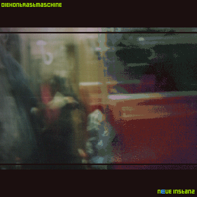
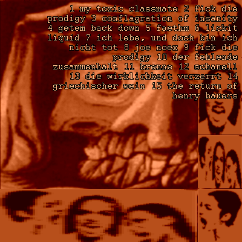

At that time, every album had at least one song called *fuck prodigy*. I liked them **a lot**
and bringing the *Jilted Generation* CD to whoever's home usually resulted in *gosh, turn it off!*... 
Until they released *Firestarter*, which was a fantastic song, the first 50 times but it was 
certainly overplayed on MTV. Now everybody was asking about that damn Prodigy CD and i was
not really interested anymore. Instead i tried hard at home, with the little Scream Tracker,
to create better music and get over with the prodigy era.

- [my toxic classmate](https://raw.githubusercontent.com/defgsus/defgsus-music/master/MODULE/INSTANZ/INTRO.S3M)
- [fick die prodigy](https://raw.githubusercontent.com/defgsus/defgsus-music/master/MODULE/INSTANZ/FLICKY.S3M)
- [conflagration of insanity](https://raw.githubusercontent.com/defgsus/defgsus-music/master/MODULE/INSTANZ/CONF.S3M)
- [bring 'em back down](https://raw.githubusercontent.com/defgsus/defgsus-music/master/MODULE/INSTANZ/BACKDOWN.S3M)
- [faethm](https://raw.githubusercontent.com/defgsus/defgsus-music/master/MODULE/INSTANZ/FAETHM.S3M)
- [lickit liquid](https://raw.githubusercontent.com/defgsus/defgsus-music/master/MODULE/INSTANZ/LIQUID.S3M)
- [ich lebe - und doch bin ich nicht tot](https://raw.githubusercontent.com/defgsus/defgsus-music/master/MODULE/INSTANZ/ICHLEBE.S3M)
- [joe noex](https://raw.githubusercontent.com/defgsus/defgsus-music/master/MODULE/INSTANZ/SPRING.S3M)
- [fick die prodigy](https://raw.githubusercontent.com/defgsus/defgsus-music/master/MODULE/INSTANZ/FICK.S3M)
- [der fehlende zusammenhalt](https://raw.githubusercontent.com/defgsus/defgsus-music/master/MODULE/INSTANZ/KRAZZ.S3M)
- [brenne](https://raw.githubusercontent.com/defgsus/defgsus-music/master/MODULE/INSTANZ/BRENNE.S3M)
- [schanell](https://raw.githubusercontent.com/defgsus/defgsus-music/master/MODULE/INSTANZ/SCHANELL.S3M)
- [die wirklichkeit verzerrt](https://raw.githubusercontent.com/defgsus/defgsus-music/master/MODULE/INSTANZ/WIRKLICH.S3M)
- [griechischer wein](https://raw.githubusercontent.com/defgsus/defgsus-music/master/MODULE/INSTANZ/UDO.S3M)
- [return of henry bauers](https://raw.githubusercontent.com/defgsus/defgsus-music/master/MODULE/INSTANZ/HENRY.S3M)

## [mictlantecuhtlis](./MODULE/MICT)

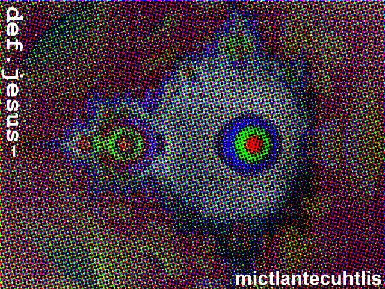

- [intro \(cliff vs. joey\)](https://raw.githubusercontent.com/defgsus/defgsus-music/master/MODULE/MICT/INTRO.S3M)
- [milch](https://raw.githubusercontent.com/defgsus/defgsus-music/master/MODULE/MICT/MILCH.S3M)
- [der gedanke an das ende ist monoton](https://raw.githubusercontent.com/defgsus/defgsus-music/master/MODULE/MICT/ENDZEIT.S3M)
- [hero mother](https://raw.githubusercontent.com/defgsus/defgsus-music/master/MODULE/MICT/BEWUST.S3M)
- [columbo I](https://raw.githubusercontent.com/defgsus/defgsus-music/master/MODULE/MICT/COLUM1.S3M)
- [die alte bäckerei](https://raw.githubusercontent.com/defgsus/defgsus-music/master/MODULE/MICT/ALTE.S3M)
- [alh-84001](https://raw.githubusercontent.com/defgsus/defgsus-music/master/MODULE/MICT/ALH84001.S3M)
- [mictlantecuhtlis](https://raw.githubusercontent.com/defgsus/defgsus-music/master/MODULE/MICT/MICTL.S3M)
- [exhibition ins tierreich](https://raw.githubusercontent.com/defgsus/defgsus-music/master/MODULE/MICT/TIER.S3M)
- [tonatiuh](https://raw.githubusercontent.com/defgsus/defgsus-music/master/MODULE/MICT/ALTE1.S3M)
- [columbo II](https://raw.githubusercontent.com/defgsus/defgsus-music/master/MODULE/MICT/COLUM2.S3M)
- [wolfgang](https://raw.githubusercontent.com/defgsus/defgsus-music/master/MODULE/MICT/WOLFGANG.S3M)
- [tennis obsessions](https://raw.githubusercontent.com/defgsus/defgsus-music/master/MODULE/MICT/TENNIS.S3M)
- [löwenzahn](https://raw.githubusercontent.com/defgsus/defgsus-music/master/MODULE/MICT/BRIDGE.S3M)
- [goldrausch](https://raw.githubusercontent.com/defgsus/defgsus-music/master/MODULE/MICT/GOLD.S3M)
- [grün \(RMX\)](https://raw.githubusercontent.com/defgsus/defgsus-music/master/MODULE/MICT/GRUEN.S3M)
- [der gedanke an das ende ist monoton \(RMX\)](https://raw.githubusercontent.com/defgsus/defgsus-music/master/MODULE/MICT/END1.S3M)
- [introvertiert & schnee](https://raw.githubusercontent.com/defgsus/defgsus-music/master/MODULE/MICT/INTROVER.S3M)
- [isotope](https://raw.githubusercontent.com/defgsus/defgsus-music/master/MODULE/MICT/ISOTOPE.S3M)
- [outro](https://raw.githubusercontent.com/defgsus/defgsus-music/master/MODULE/MICT/OUTRO.S3M)

## [ALONE](./MODULE/ALONE)

A lot of drum & base to my dear friends in Forst

- [intro](https://raw.githubusercontent.com/defgsus/defgsus-music/master/MODULE/ALONE/INTRO.S3M)
- [98.S3M](https://raw.githubusercontent.com/defgsus/defgsus-music/master/MODULE/ALONE/98.S3M)
- [ABSTURZ.S3M](https://raw.githubusercontent.com/defgsus/defgsus-music/master/MODULE/ALONE/ABSTURZ.S3M)
- [ALONE.S3M](https://raw.githubusercontent.com/defgsus/defgsus-music/master/MODULE/ALONE/ALONE.S3M)
- [B&B.S3M](https://raw.githubusercontent.com/defgsus/defgsus-music/master/MODULE/ALONE/B&B.S3M)
- [alonesom beauty](https://raw.githubusercontent.com/defgsus/defgsus-music/master/MODULE/ALONE/BEAUTY.S3M)
- [D&B.S3M](https://raw.githubusercontent.com/defgsus/defgsus-music/master/MODULE/ALONE/D&B.S3M)
- [DAST.S3M](https://raw.githubusercontent.com/defgsus/defgsus-music/master/MODULE/ALONE/DAST.S3M)
- [ein happen depressiv vorm schlafen](https://raw.githubusercontent.com/defgsus/defgsus-music/master/MODULE/ALONE/DEPRESS.S3M)
- [∙DUG∙ \(Das Ungute Gefühl\)](https://raw.githubusercontent.com/defgsus/defgsus-music/master/MODULE/ALONE/DUG.S3M)
- [∙DUG∙ \(RMX\)](https://raw.githubusercontent.com/defgsus/defgsus-music/master/MODULE/ALONE/DUG\(R\).S3M)
- [∙DUG∙ \(RMX\)](https://raw.githubusercontent.com/defgsus/defgsus-music/master/MODULE/ALONE/DUG\(R1\).S3M)
- [∙DUG∙ \(MORE\)](https://raw.githubusercontent.com/defgsus/defgsus-music/master/MODULE/ALONE/DUG\(MOR\).S3M)
- [visionäre eislandschaft](https://raw.githubusercontent.com/defgsus/defgsus-music/master/MODULE/ALONE/EIS.S3M)
- [FALL.S3M](https://raw.githubusercontent.com/defgsus/defgsus-music/master/MODULE/ALONE/FALL.S3M)
- [entfremdet](https://raw.githubusercontent.com/defgsus/defgsus-music/master/MODULE/ALONE/FREMD.S3M)
- [my girlfriend has the chance to kill](https://raw.githubusercontent.com/defgsus/defgsus-music/master/MODULE/ALONE/GIRL.S3M)
- [ich](https://raw.githubusercontent.com/defgsus/defgsus-music/master/MODULE/ALONE/ICH.S3M)
- [KRIMI.S3M](https://raw.githubusercontent.com/defgsus/defgsus-music/master/MODULE/ALONE/KRIMI.S3M)
- [die staats-pappe](https://raw.githubusercontent.com/defgsus/defgsus-music/master/MODULE/ALONE/PAPPE.S3M)
- [parallel](https://raw.githubusercontent.com/defgsus/defgsus-music/master/MODULE/ALONE/PARALLEL.S3M)
- [ein rauptier](https://raw.githubusercontent.com/defgsus/defgsus-music/master/MODULE/ALONE/RAUB.S3M)
- [flucht im rausch](https://raw.githubusercontent.com/defgsus/defgsus-music/master/MODULE/ALONE/RAUSCH.S3M)
- [regen](https://raw.githubusercontent.com/defgsus/defgsus-music/master/MODULE/ALONE/REGEN.S3M)
- [RIDER.S3M](https://raw.githubusercontent.com/defgsus/defgsus-music/master/MODULE/ALONE/RIDER.S3M)
- [stab und säule sind relativ](https://raw.githubusercontent.com/defgsus/defgsus-music/master/MODULE/ALONE/STAB.S3M)
- [STAB1.S3M](https://raw.githubusercontent.com/defgsus/defgsus-music/master/MODULE/ALONE/STAB1.S3M)
- [STAB2.S3M](https://raw.githubusercontent.com/defgsus/defgsus-music/master/MODULE/ALONE/STAB2.S3M)
- [outro](https://raw.githubusercontent.com/defgsus/defgsus-music/master/MODULE/ALONE/OUTRO.S3M)

## [Atomik Mikro Kosmos](./MODULE/ATOMIK)

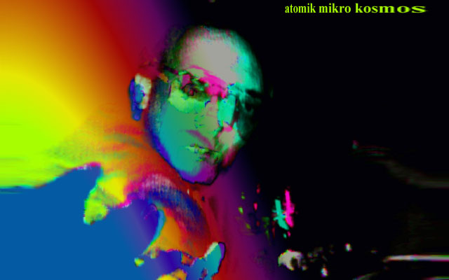
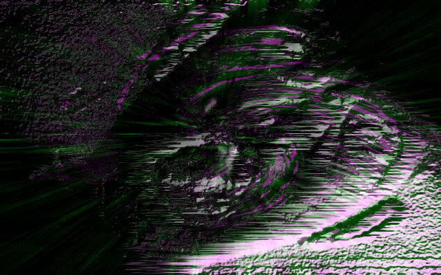

- [based on lofi I](https://raw.githubusercontent.com/defgsus/defgsus-music/master/MODULE/ATOMIK/LOFIBAS1.S3M)
- [based on lofi II](https://raw.githubusercontent.com/defgsus/defgsus-music/master/MODULE/ATOMIK/LOFIBAS2.S3M)
- [based on lofi III](https://raw.githubusercontent.com/defgsus/defgsus-music/master/MODULE/ATOMIK/LOFIBAS3.S3M)
- [einfach bis komplex](https://raw.githubusercontent.com/defgsus/defgsus-music/master/MODULE/ATOMIK/KOMPLEX.S3M)
- [stockhausen I](https://raw.githubusercontent.com/defgsus/defgsus-music/master/MODULE/ATOMIK/STOCK_I.S3M)
- [new entry](https://raw.githubusercontent.com/defgsus/defgsus-music/master/MODULE/ATOMIK/NEW.S3M)
- [stockhausen II](https://raw.githubusercontent.com/defgsus/defgsus-music/master/MODULE/ATOMIK/STOCK_II.S3M)
- [lsd brain meltdown](https://raw.githubusercontent.com/defgsus/defgsus-music/master/MODULE/ATOMIK/BRAIN.S3M)
- [faschistenpack](https://raw.githubusercontent.com/defgsus/defgsus-music/master/MODULE/ATOMIK/PACK.S3M)
- [tussis mit depressivem ausdruck](https://raw.githubusercontent.com/defgsus/defgsus-music/master/MODULE/ATOMIK/SAMBA.S3M)
- [tussis mit depressivem ausdruck II](https://raw.githubusercontent.com/defgsus/defgsus-music/master/MODULE/ATOMIK/SAMBA1.S3M)
- [milch \(rmx\)](https://raw.githubusercontent.com/defgsus/defgsus-music/master/MODULE/ATOMIK/MILCH\(R\).S3M)
- [milch \(RMX II\)](https://raw.githubusercontent.com/defgsus/defgsus-music/master/MODULE/ATOMIK/M\(R\)_1.S3M)
- [space invaders](https://raw.githubusercontent.com/defgsus/defgsus-music/master/MODULE/ATOMIK/D&B.S3M)
- [outro](https://raw.githubusercontent.com/defgsus/defgsus-music/master/MODULE/ATOMIK/OUTRO.S3M)

## [Atomik Mikro Kosmos / MILCH](./MODULE/ATOMIK/MILCH)

- [intro](https://raw.githubusercontent.com/defgsus/defgsus-music/master/MODULE/ATOMIK/MILCH/INTRO.S3M)
- [milch](https://raw.githubusercontent.com/defgsus/defgsus-music/master/MODULE/ATOMIK/MILCH/MILCH.S3M)
- [milch \(rmx\)](https://raw.githubusercontent.com/defgsus/defgsus-music/master/MODULE/ATOMIK/MILCH/M\(R\)_1.S3M)
- [interlude](https://raw.githubusercontent.com/defgsus/defgsus-music/master/MODULE/ATOMIK/MILCH/INTER\(1\).S3M)
- [milch \(RMX II\)](https://raw.githubusercontent.com/defgsus/defgsus-music/master/MODULE/ATOMIK/MILCH/M\(R\)_2.S3M)
- [network](https://raw.githubusercontent.com/defgsus/defgsus-music/master/MODULE/ATOMIK/MILCH/NETZ\(1\).S3M)
- [existent](https://raw.githubusercontent.com/defgsus/defgsus-music/master/MODULE/ATOMIK/MILCH/EXISTENT.S3M)
- [tennis obessions \(explodiat\)](https://raw.githubusercontent.com/defgsus/defgsus-music/master/MODULE/ATOMIK/MILCH/EXPLODIA.S3M)
- [milch \(RMX III\)](https://raw.githubusercontent.com/defgsus/defgsus-music/master/MODULE/ATOMIK/MILCH/M\(R\)_3.S3M)
- [der gedanke an das ende ist monoton \(RMX\)](https://raw.githubusercontent.com/defgsus/defgsus-music/master/MODULE/ATOMIK/MILCH/END_R\(1\).S3M)
- [interlude II](https://raw.githubusercontent.com/defgsus/defgsus-music/master/MODULE/ATOMIK/MILCH/INTER\(2\).S3M)
- [der gedanke an das ende ist monoton \(RMXII\)](https://raw.githubusercontent.com/defgsus/defgsus-music/master/MODULE/ATOMIK/MILCH/END_R\(2\).S3M)
- [network down](https://raw.githubusercontent.com/defgsus/defgsus-music/master/MODULE/ATOMIK/MILCH/NETZ\(2\).S3M)
- [network extra down](https://raw.githubusercontent.com/defgsus/defgsus-music/master/MODULE/ATOMIK/MILCH/NETZ\(3\).S3M)
- [network inclompete](https://raw.githubusercontent.com/defgsus/defgsus-music/master/MODULE/ATOMIK/MILCH/NETZ\(4\).S3M)
- [exhibition ins tierreich \(RMX\)](https://raw.githubusercontent.com/defgsus/defgsus-music/master/MODULE/ATOMIK/MILCH/TIER\(1\).S3M)

## [filmtheater](./MODULE/FILMTHEA)

There was an old cinema in my home town which closed in the early 90ies. It was still nice to 
read its sign and because we did used a lot of psychedelics at the time, 
*filmtheater* was kind of a synonym for enjoying the inner and outer universe.

After a couple of years of intensive *tracking* the quality of the songs became a lot better
even though it was the same program with the same absurd memory limitations.

- [wolken](https://raw.githubusercontent.com/defgsus/defgsus-music/master/MODULE/FILMTHEA/WOLKEN.S3M)
- [gegenwolken](https://raw.githubusercontent.com/defgsus/defgsus-music/master/MODULE/FILMTHEA/GWOLKEN.S3M)
- [um mitzuteilen, daß alles einer lüge gleichkommt \(intro\)](https://raw.githubusercontent.com/defgsus/defgsus-music/master/MODULE/FILMTHEA/LIE_INT.S3M)
- [um mitzuteilen, daß alles einer lüge gleichkommt](https://raw.githubusercontent.com/defgsus/defgsus-music/master/MODULE/FILMTHEA/LIE.S3M)
- [mono{ hoast }](https://raw.githubusercontent.com/defgsus/defgsus-music/master/MODULE/FILMTHEA/MONO.S3M)
- [gegen](https://raw.githubusercontent.com/defgsus/defgsus-music/master/MODULE/FILMTHEA/GEGEN.S3M)
- [NONAME.S3M](https://raw.githubusercontent.com/defgsus/defgsus-music/master/MODULE/FILMTHEA/NONAME.S3M)
- [noone but me could really understand](https://raw.githubusercontent.com/defgsus/defgsus-music/master/MODULE/FILMTHEA/NOONE.S3M)
- [could this be wrong{ ? }](https://raw.githubusercontent.com/defgsus/defgsus-music/master/MODULE/FILMTHEA/WRONG.S3M)

## [filmtheater I](./MODULE/FILMTHEA/I)

- [intro](https://raw.githubusercontent.com/defgsus/defgsus-music/master/MODULE/FILMTHEA/I/INTRO_1.S3M)
- [alone in the room](https://raw.githubusercontent.com/defgsus/defgsus-music/master/MODULE/FILMTHEA/I/ALONE.S3M)
- [dxm](https://raw.githubusercontent.com/defgsus/defgsus-music/master/MODULE/FILMTHEA/I/DXM.S3M)
- [einbruch](https://raw.githubusercontent.com/defgsus/defgsus-music/master/MODULE/FILMTHEA/I/EINBRUCH.S3M)
- [innen](https://raw.githubusercontent.com/defgsus/defgsus-music/master/MODULE/FILMTHEA/I/INNEN.S3M)
- [not what you expected](https://raw.githubusercontent.com/defgsus/defgsus-music/master/MODULE/FILMTHEA/I/EXPECTED.S3M)
- [manche menschen verdrängen ihre emotionen bis zu unkenntlichkeit](https://raw.githubusercontent.com/defgsus/defgsus-music/master/MODULE/FILMTHEA/I/GLAUBT.S3M)
- [kinderherbst](https://raw.githubusercontent.com/defgsus/defgsus-music/master/MODULE/FILMTHEA/I/HERBST.S3M)
- [idiots and monkeys &](https://raw.githubusercontent.com/defgsus/defgsus-music/master/MODULE/FILMTHEA/I/IDIOTS.S3M)
- [idiots with monkey-masks](https://raw.githubusercontent.com/defgsus/defgsus-music/master/MODULE/FILMTHEA/I/MASKS.S3M)
- [far from the masses](https://raw.githubusercontent.com/defgsus/defgsus-music/master/MODULE/FILMTHEA/I/MASSES.S3M)
- [tilomat](https://raw.githubusercontent.com/defgsus/defgsus-music/master/MODULE/FILMTHEA/I/TILOMAT.S3M)

## [filmtheater II](./MODULE/FILMTHEA/II)

- [prolog](https://raw.githubusercontent.com/defgsus/defgsus-music/master/MODULE/FILMTHEA/II/PROLOG.S3M)
- [intro](https://raw.githubusercontent.com/defgsus/defgsus-music/master/MODULE/FILMTHEA/II/INTRO_2.S3M)
- [die augen eines blinden I](https://raw.githubusercontent.com/defgsus/defgsus-music/master/MODULE/FILMTHEA/II/BLIND.S3M)
- [die augen eines blinden \]\
- [die augen eines blinden \]I\
- [i cry for all of us](https://raw.githubusercontent.com/defgsus/defgsus-music/master/MODULE/FILMTHEA/II/CRY.S3M)
- [sometimes, i hate everybody](https://raw.githubusercontent.com/defgsus/defgsus-music/master/MODULE/FILMTHEA/II/HATE.S3M)
- [no](https://raw.githubusercontent.com/defgsus/defgsus-music/master/MODULE/FILMTHEA/II/NO.S3M)
- [but kNOw](https://raw.githubusercontent.com/defgsus/defgsus-music/master/MODULE/FILMTHEA/II/KNOW.S3M)
- [the point of self-existence in my life](https://raw.githubusercontent.com/defgsus/defgsus-music/master/MODULE/FILMTHEA/II/POINT.S3M)
- [tontot](https://raw.githubusercontent.com/defgsus/defgsus-music/master/MODULE/FILMTHEA/II/TONTOT.S3M)
- [electric snow](https://raw.githubusercontent.com/defgsus/defgsus-music/master/MODULE/FILMTHEA/II/SNOW.S3M)
- [prolog \(epilog\)](https://raw.githubusercontent.com/defgsus/defgsus-music/master/MODULE/FILMTHEA/II/PROLOG1.S3M)

## [filmtheater III](./MODULE/FILMTHEA/III)

- [die augen eines blinden](https://raw.githubusercontent.com/defgsus/defgsus-music/master/MODULE/FILMTHEA/III/INTRO_3.S3M)
- [velvet warhole](https://raw.githubusercontent.com/defgsus/defgsus-music/master/MODULE/FILMTHEA/III/ANDYW.S3M)
- [velvet warhole \(RMX\)](https://raw.githubusercontent.com/defgsus/defgsus-music/master/MODULE/FILMTHEA/III/ANDYW1.S3M)
- [BaSchRo](https://raw.githubusercontent.com/defgsus/defgsus-music/master/MODULE/FILMTHEA/III/BASCHRO.S3M)
- [3 stunden chemie ausfall](https://raw.githubusercontent.com/defgsus/defgsus-music/master/MODULE/FILMTHEA/III/CHEMIE.S3M)
- [DEVIAT.S3M](https://raw.githubusercontent.com/defgsus/defgsus-music/master/MODULE/FILMTHEA/III/DEVIAT.S3M)
- [diese droge, das ist...](https://raw.githubusercontent.com/defgsus/defgsus-music/master/MODULE/FILMTHEA/III/DROGE.S3M)
- [diese droge, das ist... \(RMX\)](https://raw.githubusercontent.com/defgsus/defgsus-music/master/MODULE/FILMTHEA/III/DROGE1.S3M)
- [64 salutschüsse zu ehren der knallfolie](https://raw.githubusercontent.com/defgsus/defgsus-music/master/MODULE/FILMTHEA/III/KNALL.S3M)
- [um mitzuteilen, daß alles einer lüge gleichkommt](https://raw.githubusercontent.com/defgsus/defgsus-music/master/MODULE/FILMTHEA/III/LIE_RMX.S3M)
- [mental changes](https://raw.githubusercontent.com/defgsus/defgsus-music/master/MODULE/FILMTHEA/III/MENTAL.S3M)
- [PILZ.S3M](https://raw.githubusercontent.com/defgsus/defgsus-music/master/MODULE/FILMTHEA/III/PILZ.S3M)
- [trotzdem sehen](https://raw.githubusercontent.com/defgsus/defgsus-music/master/MODULE/FILMTHEA/III/SEHEN.S3M)
- [trotzdem sehen](https://raw.githubusercontent.com/defgsus/defgsus-music/master/MODULE/FILMTHEA/III/SEHEN1.S3M)
- [der song der zuviel wußte](https://raw.githubusercontent.com/defgsus/defgsus-music/master/MODULE/FILMTHEA/III/SOUNNGG.S3M)
- [system der macht](https://raw.githubusercontent.com/defgsus/defgsus-music/master/MODULE/FILMTHEA/III/SYSTEM.S3M)
- [TECH.S3M](https://raw.githubusercontent.com/defgsus/defgsus-music/master/MODULE/FILMTHEA/III/TECH.S3M)
- [fass das ma in worte](https://raw.githubusercontent.com/defgsus/defgsus-music/master/MODULE/FILMTHEA/III/WORTE.S3M)

## [filmtheater MUTATION](./MODULE/FILMTHEA/MUTATION)

The 4th remix album in a row ;)

At that time various people knew my tracks and i *sometimes* played in clubs, carrying ye olde
386 and a cathode ray monitor to the dance floor.

- [intro](https://raw.githubusercontent.com/defgsus/defgsus-music/master/MODULE/FILMTHEA/MUTATION/INTRO.S3M)
- [120127.S3M](https://raw.githubusercontent.com/defgsus/defgsus-music/master/MODULE/FILMTHEA/MUTATION/120127.S3M)
- [ALKOHOL](https://raw.githubusercontent.com/defgsus/defgsus-music/master/MODULE/FILMTHEA/MUTATION/ALKOHOL.S3M)
- [bine](https://raw.githubusercontent.com/defgsus/defgsus-music/master/MODULE/FILMTHEA/MUTATION/BINE.S3M)
- [bine \(anders\)](https://raw.githubusercontent.com/defgsus/defgsus-music/master/MODULE/FILMTHEA/MUTATION/BINE1.S3M)
- [chambers of mutation](https://raw.githubusercontent.com/defgsus/defgsus-music/master/MODULE/FILMTHEA/MUTATION/CHAMBER.S3M)
- [chambers of mutation \(epilog\)](https://raw.githubusercontent.com/defgsus/defgsus-music/master/MODULE/FILMTHEA/MUTATION/CH_EPIL.S3M)
- [chillen&grillen](https://raw.githubusercontent.com/defgsus/defgsus-music/master/MODULE/FILMTHEA/MUTATION/CHILL.S3M)
- [DAB.S3M](https://raw.githubusercontent.com/defgsus/defgsus-music/master/MODULE/FILMTHEA/MUTATION/DAB.S3M)
- [dublin lines](https://raw.githubusercontent.com/defgsus/defgsus-music/master/MODULE/FILMTHEA/MUTATION/DUBLIN.S3M)
- [dublin lines](https://raw.githubusercontent.com/defgsus/defgsus-music/master/MODULE/FILMTHEA/MUTATION/DUBLIN1.S3M)
- [faethm with hoast](https://raw.githubusercontent.com/defgsus/defgsus-music/master/MODULE/FILMTHEA/MUTATION/FAETHM.S3M)
- [FAT.S3M](https://raw.githubusercontent.com/defgsus/defgsus-music/master/MODULE/FILMTHEA/MUTATION/FAT.S3M)
- [FLOYD.S3M](https://raw.githubusercontent.com/defgsus/defgsus-music/master/MODULE/FILMTHEA/MUTATION/FLOYD.S3M)
- [hiphop](https://raw.githubusercontent.com/defgsus/defgsus-music/master/MODULE/FILMTHEA/MUTATION/HIPHOP.S3M)
- [HNO.S3M](https://raw.githubusercontent.com/defgsus/defgsus-music/master/MODULE/FILMTHEA/MUTATION/HNO.S3M)
- [holz ist](https://raw.githubusercontent.com/defgsus/defgsus-music/master/MODULE/FILMTHEA/MUTATION/HOLZ.S3M)
- [JG.S3M](https://raw.githubusercontent.com/defgsus/defgsus-music/master/MODULE/FILMTHEA/MUTATION/JG.S3M)
- [maschinenkante](https://raw.githubusercontent.com/defgsus/defgsus-music/master/MODULE/FILMTHEA/MUTATION/KANTE.S3M)
- [MEM.S3M](https://raw.githubusercontent.com/defgsus/defgsus-music/master/MODULE/FILMTHEA/MUTATION/MEM.S3M)
- [mesc.](https://raw.githubusercontent.com/defgsus/defgsus-music/master/MODULE/FILMTHEA/MUTATION/MESC.S3M)
- [modus](https://raw.githubusercontent.com/defgsus/defgsus-music/master/MODULE/FILMTHEA/MUTATION/MODUS.S3M)
- [monkeys have reached dangerous levels](https://raw.githubusercontent.com/defgsus/defgsus-music/master/MODULE/FILMTHEA/MUTATION/MONKEY.S3M)
- [MUTAT1.S3M](https://raw.githubusercontent.com/defgsus/defgsus-music/master/MODULE/FILMTHEA/MUTATION/MUTAT1.S3M)
- [die neue traurigkeit](https://raw.githubusercontent.com/defgsus/defgsus-music/master/MODULE/FILMTHEA/MUTATION/NEUE.S3M)
- [SAMBA.S3M](https://raw.githubusercontent.com/defgsus/defgsus-music/master/MODULE/FILMTHEA/MUTATION/SAMBA.S3M)
- [SOME.S3M](https://raw.githubusercontent.com/defgsus/defgsus-music/master/MODULE/FILMTHEA/MUTATION/SOME.S3M)
- [strikt rythmus](https://raw.githubusercontent.com/defgsus/defgsus-music/master/MODULE/FILMTHEA/MUTATION/STRIKT.S3M)
- [strikt rythmus \(untanzbar entrückt\)](https://raw.githubusercontent.com/defgsus/defgsus-music/master/MODULE/FILMTHEA/MUTATION/STRIK_U.S3M)
- [WOHN.S3M](https://raw.githubusercontent.com/defgsus/defgsus-music/master/MODULE/FILMTHEA/MUTATION/WOHN.S3M)

## [tribbrulR](./MODULE/TRIBB)

In the beginning i was **very much** against monotonic basedrum music. That changed.

- [die anatomie eines kuhzüchters](https://raw.githubusercontent.com/defgsus/defgsus-music/master/MODULE/TRIBB/ANATOM.S3M)
- [atropin](https://raw.githubusercontent.com/defgsus/defgsus-music/master/MODULE/TRIBB/ATROPIN.S3M)
- [mono-beauty](https://raw.githubusercontent.com/defgsus/defgsus-music/master/MODULE/TRIBB/BEAUTY.S3M)
- [stereo-beauty](https://raw.githubusercontent.com/defgsus/defgsus-music/master/MODULE/TRIBB/BEAUTY2.S3M)
- [fraktal-beauty](https://raw.githubusercontent.com/defgsus/defgsus-music/master/MODULE/TRIBB/BEAUTY3.S3M)
- [FAQ](https://raw.githubusercontent.com/defgsus/defgsus-music/master/MODULE/TRIBB/FAQ.S3M)
- [fat freddy's cat](https://raw.githubusercontent.com/defgsus/defgsus-music/master/MODULE/TRIBB/FAT.S3M)
- [fat freddy's cat II](https://raw.githubusercontent.com/defgsus/defgsus-music/master/MODULE/TRIBB/FAT1.S3M)
- [fuck you _mother](https://raw.githubusercontent.com/defgsus/defgsus-music/master/MODULE/TRIBB/FUCK.S3M)
- [GROOVE.S3M](https://raw.githubusercontent.com/defgsus/defgsus-music/master/MODULE/TRIBB/GROOVE.S3M)
- [introvertiert & schnee](https://raw.githubusercontent.com/defgsus/defgsus-music/master/MODULE/TRIBB/INTROVER.S3M)
- [joe noex introducing](https://raw.githubusercontent.com/defgsus/defgsus-music/master/MODULE/TRIBB/JOE\(BYE!.S3M)
- [joe noex introducing](https://raw.githubusercontent.com/defgsus/defgsus-music/master/MODULE/TRIBB/JOE\(RMX\).S3M)
- [nie wieder <labor>](https://raw.githubusercontent.com/defgsus/defgsus-music/master/MODULE/TRIBB/LABOR.S3M)
- [LSD\(1\).S3M](https://raw.githubusercontent.com/defgsus/defgsus-music/master/MODULE/TRIBB/LSD\(1\).S3M)
- [lsd_junkie \(PART I\)](https://raw.githubusercontent.com/defgsus/defgsus-music/master/MODULE/TRIBB/LSD_J\(1\).S3M)
- [MICT.S3M](https://raw.githubusercontent.com/defgsus/defgsus-music/master/MODULE/TRIBB/MICT.S3M)
- [die wunderbare welt der frequenzmodulation](https://raw.githubusercontent.com/defgsus/defgsus-music/master/MODULE/TRIBB/MODULA.S3M)
- [keine mucke zum verstehn](https://raw.githubusercontent.com/defgsus/defgsus-music/master/MODULE/TRIBB/MUCKE\(1\).S3M)
- [keine mucke zum verstehn II](https://raw.githubusercontent.com/defgsus/defgsus-music/master/MODULE/TRIBB/MUCKE\(2\).S3M)
- [the narcotic choice](https://raw.githubusercontent.com/defgsus/defgsus-music/master/MODULE/TRIBB/NARCOTIC.S3M)
- [the narcotic RMX](https://raw.githubusercontent.com/defgsus/defgsus-music/master/MODULE/TRIBB/NARCO\(R\).S3M)
- [network down \(rMx\)](https://raw.githubusercontent.com/defgsus/defgsus-music/master/MODULE/TRIBB/NETZ\(R2\).S3M)
- [itz a true story](https://raw.githubusercontent.com/defgsus/defgsus-music/master/MODULE/TRIBB/STORY.S3M)
- [my toxic classmate\(R\)](https://raw.githubusercontent.com/defgsus/defgsus-music/master/MODULE/TRIBB/TOXIC\(R\).S3M)
- [tribbrulR](https://raw.githubusercontent.com/defgsus/defgsus-music/master/MODULE/TRIBB/TRIBB.S3M)
- [TRIP1.S3M](https://raw.githubusercontent.com/defgsus/defgsus-music/master/MODULE/TRIBB/TRIP1.S3M)
- [the animal in](https://raw.githubusercontent.com/defgsus/defgsus-music/master/MODULE/TRIBB/TRIP2.S3M)
- [durch das wurmloch gegangenes trippa](https://raw.githubusercontent.com/defgsus/defgsus-music/master/MODULE/TRIBB/TRIPPA.S3M)
- [TSCHAEZZ.S3M](https://raw.githubusercontent.com/defgsus/defgsus-music/master/MODULE/TRIBB/TSCHAEZZ.S3M)
- [die wechselwirkung von alk und chemie](https://raw.githubusercontent.com/defgsus/defgsus-music/master/MODULE/TRIBB/ZLETCH.S3M)
- [die wechselwirkung von alk und chemie \(RMX\)](https://raw.githubusercontent.com/defgsus/defgsus-music/master/MODULE/TRIBB/ZLETCH\(R.S3M)
- [outro](https://raw.githubusercontent.com/defgsus/defgsus-music/master/MODULE/TRIBB/OUTRO.S3M)
- [OUTROII.S3M](https://raw.githubusercontent.com/defgsus/defgsus-music/master/MODULE/TRIBB/OUTROII.S3M)

## [about{ hoast }](./MODULE/HOAST)

*Hoast* was some spiritual entity to which contact was reached through LSD and the like. 
My friend and i were talking endlessly about these topics. Though, nothing particular
comes to my mind twenty years after..

The first tape had this terrible *"mariujahna"* spelling on the cover and, after a hint, 
the next tapes had *I was already informed about the mis-spelling of mariujahna* on it.

- [intro](https://raw.githubusercontent.com/defgsus/defgsus-music/master/MODULE/HOAST/INTRO.S3M)
- [zukunftsvisionen für 99](https://raw.githubusercontent.com/defgsus/defgsus-music/master/MODULE/HOAST/99.S3M)
- [schwarz](https://raw.githubusercontent.com/defgsus/defgsus-music/master/MODULE/HOAST/BLACK.S3M)
- [doors of perception \(intro\)](https://raw.githubusercontent.com/defgsus/defgsus-music/master/MODULE/HOAST/DOORS.S3M)
- [visionäre eislandschaft](https://raw.githubusercontent.com/defgsus/defgsus-music/master/MODULE/HOAST/EIS.S3M)
- [das forst verhängnis](https://raw.githubusercontent.com/defgsus/defgsus-music/master/MODULE/HOAST/FORST\(1\).S3M)
- [das forst verhängniss](https://raw.githubusercontent.com/defgsus/defgsus-music/master/MODULE/HOAST/FORST\(2\).S3M)
- [das forst verhängnisss](https://raw.githubusercontent.com/defgsus/defgsus-music/master/MODULE/HOAST/FORST\(3\).S3M)
- [grass](https://raw.githubusercontent.com/defgsus/defgsus-music/master/MODULE/HOAST/GRASS.S3M)
- [ich sah hoast](https://raw.githubusercontent.com/defgsus/defgsus-music/master/MODULE/HOAST/HOAST.S3M)
- [der mariujahna-konsum als basis der überlegung](https://raw.githubusercontent.com/defgsus/defgsus-music/master/MODULE/HOAST/KIFF.S3M)
- [micro](https://raw.githubusercontent.com/defgsus/defgsus-music/master/MODULE/HOAST/MICRO.S3M)
- [schlüsselszenen](https://raw.githubusercontent.com/defgsus/defgsus-music/master/MODULE/HOAST/SCHLUESS.S3M)
- [short waylayed freedom](https://raw.githubusercontent.com/defgsus/defgsus-music/master/MODULE/HOAST/SHORT.S3M)
- [TRICK.S3M](https://raw.githubusercontent.com/defgsus/defgsus-music/master/MODULE/HOAST/TRICK.S3M)

## [about{ hoast} / TASSE](./MODULE/HOAST/TASSE)

- [intro](https://raw.githubusercontent.com/defgsus/defgsus-music/master/MODULE/HOAST/TASSE/INTRO.S3M)
- [visionäre eiswelt](https://raw.githubusercontent.com/defgsus/defgsus-music/master/MODULE/HOAST/TASSE/EIS.S3M)
- [intuitive extraordination](https://raw.githubusercontent.com/defgsus/defgsus-music/master/MODULE/HOAST/TASSE/EXTRA.S3M)
- [flirting of three fat kats](https://raw.githubusercontent.com/defgsus/defgsus-music/master/MODULE/HOAST/TASSE/KATS.S3M)
- [der mariujahna-konsum als basis der überlegung \(intro\)](https://raw.githubusercontent.com/defgsus/defgsus-music/master/MODULE/HOAST/TASSE/KIFF\(IN\).S3M)
- [der mariujahna-konsum als basis der überlegung](https://raw.githubusercontent.com/defgsus/defgsus-music/master/MODULE/HOAST/TASSE/KIFF.S3M)
- [micro \(intro\)](https://raw.githubusercontent.com/defgsus/defgsus-music/master/MODULE/HOAST/TASSE/MICR\(IN\).S3M)
- [micro](https://raw.githubusercontent.com/defgsus/defgsus-music/master/MODULE/HOAST/TASSE/MICRO.S3M)
- [scream what you scream](https://raw.githubusercontent.com/defgsus/defgsus-music/master/MODULE/HOAST/TASSE/SCREAM.S3M)
- [der name ist zu simpel](https://raw.githubusercontent.com/defgsus/defgsus-music/master/MODULE/HOAST/TASSE/SIMPEL.S3M)
- [the trick](https://raw.githubusercontent.com/defgsus/defgsus-music/master/MODULE/HOAST/TASSE/TRICK.S3M)

## [TRASH1](./MODULE/TRASH1)

The TRASH folders stored songs that did not fit to the current project, or were plainly just the `x`th remix of something else. Over time, a couple of stuff landed there. No way to put it in chronological order any more.

- [intro](https://raw.githubusercontent.com/defgsus/defgsus-music/master/MODULE/TRASH1/LSD.S3M)
- [BASE.S3M](https://raw.githubusercontent.com/defgsus/defgsus-music/master/MODULE/TRASH1/BASE.S3M)
- [BASE1.S3M](https://raw.githubusercontent.com/defgsus/defgsus-music/master/MODULE/TRASH1/BASE1.S3M)
- [BASE2.S3M](https://raw.githubusercontent.com/defgsus/defgsus-music/master/MODULE/TRASH1/BASE2.S3M)
- [BASE3.S3M](https://raw.githubusercontent.com/defgsus/defgsus-music/master/MODULE/TRASH1/BASE3.S3M)
- [die baustelle](https://raw.githubusercontent.com/defgsus/defgsus-music/master/MODULE/TRASH1/BAU.S3M)
- [kreativer nährboden](https://raw.githubusercontent.com/defgsus/defgsus-music/master/MODULE/TRASH1/BODEN.S3M)
- [DDEGS_X.S3M](https://raw.githubusercontent.com/defgsus/defgsus-music/master/MODULE/TRASH1/DDEGS_X.S3M)
- [ich und main fahrrad](https://raw.githubusercontent.com/defgsus/defgsus-music/master/MODULE/TRASH1/FAHRRAD.S3M)
- [ich und main fahrrad](https://raw.githubusercontent.com/defgsus/defgsus-music/master/MODULE/TRASH1/FAHRRAD1.S3M)
- [HOWZ2.S3M](https://raw.githubusercontent.com/defgsus/defgsus-music/master/MODULE/TRASH1/HOWZ2.S3M)
- [HOWZ4.S3M](https://raw.githubusercontent.com/defgsus/defgsus-music/master/MODULE/TRASH1/HOWZ4.S3M)
- [HOWZ6.S3M](https://raw.githubusercontent.com/defgsus/defgsus-music/master/MODULE/TRASH1/HOWZ6.S3M)
- [IPANEMA.S3M](https://raw.githubusercontent.com/defgsus/defgsus-music/master/MODULE/TRASH1/IPANEMA.S3M)
- [LALALA.S3M](https://raw.githubusercontent.com/defgsus/defgsus-music/master/MODULE/TRASH1/LALALA.S3M)
- [ohne bleiche](https://raw.githubusercontent.com/defgsus/defgsus-music/master/MODULE/TRASH1/OHNE_BL.S3M)
- [grabed & rmXed](https://raw.githubusercontent.com/defgsus/defgsus-music/master/MODULE/TRASH1/RMX_GRAB.S3M)
- [SCHMANT.S3M](https://raw.githubusercontent.com/defgsus/defgsus-music/master/MODULE/TRASH1/SCHMANT.S3M)
- [sehnsucht nach dem alten schmerzz](https://raw.githubusercontent.com/defgsus/defgsus-music/master/MODULE/TRASH1/SEHNSUCH.S3M)
- [IMPM](https://raw.githubusercontent.com/defgsus/defgsus-music/master/MODULE/TRASH1/STILLE.S3M)
- [STRANGE.S3M](https://raw.githubusercontent.com/defgsus/defgsus-music/master/MODULE/TRASH1/STRANGE.S3M)
- [tot durch ersticken](https://raw.githubusercontent.com/defgsus/defgsus-music/master/MODULE/TRASH1/TOT.S3M)
- [VERS2.S3M](https://raw.githubusercontent.com/defgsus/defgsus-music/master/MODULE/TRASH1/VERS2.S3M)
- [in einer zeit, vor unserem Land](https://raw.githubusercontent.com/defgsus/defgsus-music/master/MODULE/TRASH1/ZEIT.S3M)

## [TRASH1/MICT](./MODULE/TRASH1/MICT)

- [sonata](https://raw.githubusercontent.com/defgsus/defgsus-music/master/MODULE/TRASH1/MICT/ALT.S3M)
- [DREAD.S3M](https://raw.githubusercontent.com/defgsus/defgsus-music/master/MODULE/TRASH1/MICT/DREAD.S3M)
- [DREADBAS.S3M](https://raw.githubusercontent.com/defgsus/defgsus-music/master/MODULE/TRASH1/MICT/DREADBAS.S3M)
- [MICT.S3M](https://raw.githubusercontent.com/defgsus/defgsus-music/master/MODULE/TRASH1/MICT/MICT.S3M)
- [sativa](https://raw.githubusercontent.com/defgsus/defgsus-music/master/MODULE/TRASH1/MICT/SATIVA.S3M)
- [sativa II](https://raw.githubusercontent.com/defgsus/defgsus-music/master/MODULE/TRASH1/MICT/SATIVA2.S3M)

## [TRASH2](./MODULE/TRASH2)

- [INTRO.S3M](https://raw.githubusercontent.com/defgsus/defgsus-music/master/MODULE/TRASH2/INTRO.S3M)
- [INTRO2.S3M](https://raw.githubusercontent.com/defgsus/defgsus-music/master/MODULE/TRASH2/INTRO2.S3M)
- [die boikrupp](https://raw.githubusercontent.com/defgsus/defgsus-music/master/MODULE/TRASH2/BOI.S3M)
- [fick die prodigy](https://raw.githubusercontent.com/defgsus/defgsus-music/master/MODULE/TRASH2/BREAK.S3M)
- [COOL.S3M](https://raw.githubusercontent.com/defgsus/defgsus-music/master/MODULE/TRASH2/COOL.S3M)
- [COOL1.S3M](https://raw.githubusercontent.com/defgsus/defgsus-music/master/MODULE/TRASH2/COOL1.S3M)
- [COOL2.S3M](https://raw.githubusercontent.com/defgsus/defgsus-music/master/MODULE/TRASH2/COOL2.S3M)
- [D&B.S3M](https://raw.githubusercontent.com/defgsus/defgsus-music/master/MODULE/TRASH2/D&B.S3M)
- [D&B1.S3M](https://raw.githubusercontent.com/defgsus/defgsus-music/master/MODULE/TRASH2/D&B1.S3M)
- [DEF1.S3M](https://raw.githubusercontent.com/defgsus/defgsus-music/master/MODULE/TRASH2/DEF1.S3M)
- [DEF2.S3M](https://raw.githubusercontent.com/defgsus/defgsus-music/master/MODULE/TRASH2/DEF2.S3M)
- [EXP.S3M](https://raw.githubusercontent.com/defgsus/defgsus-music/master/MODULE/TRASH2/EXP.S3M)
- [fat freddy's cat](https://raw.githubusercontent.com/defgsus/defgsus-music/master/MODULE/TRASH2/FAT1.S3M)
- [GMF.S3M](https://raw.githubusercontent.com/defgsus/defgsus-music/master/MODULE/TRASH2/GMF.S3M)
- [GUIT.S3M](https://raw.githubusercontent.com/defgsus/defgsus-music/master/MODULE/TRASH2/GUIT.S3M)
- [GUIT1.S3M](https://raw.githubusercontent.com/defgsus/defgsus-music/master/MODULE/TRASH2/GUIT1.S3M)
- [HACHT.S3M](https://raw.githubusercontent.com/defgsus/defgsus-music/master/MODULE/TRASH2/HACHT.S3M)
- [KDFJHG.S3M](https://raw.githubusercontent.com/defgsus/defgsus-music/master/MODULE/TRASH2/KDFJHG.S3M)
- [KDJFH.S3M](https://raw.githubusercontent.com/defgsus/defgsus-music/master/MODULE/TRASH2/KDJFH.S3M)
- [KIKI.S3M](https://raw.githubusercontent.com/defgsus/defgsus-music/master/MODULE/TRASH2/KIKI.S3M)
- [KLAKK.S3M](https://raw.githubusercontent.com/defgsus/defgsus-music/master/MODULE/TRASH2/KLAKK.S3M)
- [KLHJ.S3M](https://raw.githubusercontent.com/defgsus/defgsus-music/master/MODULE/TRASH2/KLHJ.S3M)
- [LATIFA.S3M](https://raw.githubusercontent.com/defgsus/defgsus-music/master/MODULE/TRASH2/LATIFA.S3M)
- [MELOD.S3M](https://raw.githubusercontent.com/defgsus/defgsus-music/master/MODULE/TRASH2/MELOD.S3M)
- [MELT.S3M](https://raw.githubusercontent.com/defgsus/defgsus-music/master/MODULE/TRASH2/MELT.S3M)
- [MEN1.S3M](https://raw.githubusercontent.com/defgsus/defgsus-music/master/MODULE/TRASH2/MEN1.S3M)
- [NAMELESS.S3M](https://raw.githubusercontent.com/defgsus/defgsus-music/master/MODULE/TRASH2/NAMELESS.S3M)
- [OLDSCHOO.S3M](https://raw.githubusercontent.com/defgsus/defgsus-music/master/MODULE/TRASH2/OLDSCHOO.S3M)
- [P&M.S3M](https://raw.githubusercontent.com/defgsus/defgsus-music/master/MODULE/TRASH2/P&M.S3M)
- [RELAX.S3M](https://raw.githubusercontent.com/defgsus/defgsus-music/master/MODULE/TRASH2/RELAX.S3M)
- [SCHANELL.S3M](https://raw.githubusercontent.com/defgsus/defgsus-music/master/MODULE/TRASH2/SCHANELL.S3M)
- [7:13](https://raw.githubusercontent.com/defgsus/defgsus-music/master/MODULE/TRASH2/SHORT.S3M)
- [13:50](https://raw.githubusercontent.com/defgsus/defgsus-music/master/MODULE/TRASH2/SJBFSDFJ.S3M)
- [SLEEP.S3M](https://raw.githubusercontent.com/defgsus/defgsus-music/master/MODULE/TRASH2/SLEEP.S3M)
- [SLOW.S3M](https://raw.githubusercontent.com/defgsus/defgsus-music/master/MODULE/TRASH2/SLOW.S3M)
- [SOFT.S3M](https://raw.githubusercontent.com/defgsus/defgsus-music/master/MODULE/TRASH2/SOFT.S3M)
- [SPACE.S3M](https://raw.githubusercontent.com/defgsus/defgsus-music/master/MODULE/TRASH2/SPACE.S3M)
- [SPEECH.S3M](https://raw.githubusercontent.com/defgsus/defgsus-music/master/MODULE/TRASH2/SPEECH.S3M)
- [STRING.S3M](https://raw.githubusercontent.com/defgsus/defgsus-music/master/MODULE/TRASH2/STRING.S3M)
- [TECCA.S3M](https://raw.githubusercontent.com/defgsus/defgsus-music/master/MODULE/TRASH2/TECCA.S3M)
- [wut und so](https://raw.githubusercontent.com/defgsus/defgsus-music/master/MODULE/TRASH2/WUT.S3M)
- [outro](https://raw.githubusercontent.com/defgsus/defgsus-music/master/MODULE/TRASH2/BREAK1.S3M)
- [OUTRO.S3M](https://raw.githubusercontent.com/defgsus/defgsus-music/master/MODULE/TRASH2/OUTRO.S3M)
- [OUTRO1.S3M](https://raw.githubusercontent.com/defgsus/defgsus-music/master/MODULE/TRASH2/OUTRO1.S3M)

## [TRASH3](./MODULE/TRASH3)

- [DISKO.S3M](https://raw.githubusercontent.com/defgsus/defgsus-music/master/MODULE/TRASH3/DISKO.S3M)
- [das forst verhängniss](https://raw.githubusercontent.com/defgsus/defgsus-music/master/MODULE/TRASH3/FORST\(2\).S3M)
- [LSD_J\(2\).S3M](https://raw.githubusercontent.com/defgsus/defgsus-music/master/MODULE/TRASH3/LSD_J\(2\).S3M)
- [MICT1.S3M](https://raw.githubusercontent.com/defgsus/defgsus-music/master/MODULE/TRASH3/MICT1.S3M)
- [network \(rmx\)](https://raw.githubusercontent.com/defgsus/defgsus-music/master/MODULE/TRASH3/NETZ\(R1\).S3M)
- [OUTROIII.S3M](https://raw.githubusercontent.com/defgsus/defgsus-music/master/MODULE/TRASH3/OUTROIII.S3M)
- [PROPAN.S3M](https://raw.githubusercontent.com/defgsus/defgsus-music/master/MODULE/TRASH3/PROPAN.S3M)
- [SMOOTH.S3M](https://raw.githubusercontent.com/defgsus/defgsus-music/master/MODULE/TRASH3/SMOOTH.S3M)
- [STORY\(A\).S3M](https://raw.githubusercontent.com/defgsus/defgsus-music/master/MODULE/TRASH3/STORY\(A\).S3M)
- [TEKK.S3M](https://raw.githubusercontent.com/defgsus/defgsus-music/master/MODULE/TRASH3/TEKK.S3M)
- [always walk on the same](https://raw.githubusercontent.com/defgsus/defgsus-music/master/MODULE/TRASH3/THESAME.S3M)
- [TJA.S3M](https://raw.githubusercontent.com/defgsus/defgsus-music/master/MODULE/TRASH3/TJA.S3M)
- [xtended night reality](https://raw.githubusercontent.com/defgsus/defgsus-music/master/MODULE/TRASH3/XTEND.S3M)

